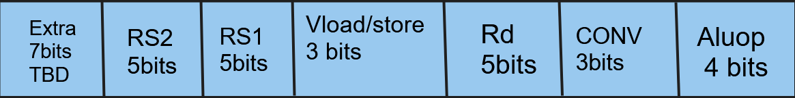

# VectorProcessor
Vector Processor for fast Convolutions
 
Compnents 
 
   32 bit Fp Dadda multiplier 
    
   32 bit Fp adder
    
   Full adder 
    
   Compressor
      
   Convolutional unit
    

Instruction is 
 

 
rd , rs1,rs2 are destination ,source registers 1 and 2 respectively
 
Aluop tells which operations to peform add or multiply 
 
conv bits tells if convolution is to be prfomed and for how many elements lsb if 1 we do convolutions and rest 2 
 
tell no of elements so 111 is 3 elements convolutions
 

   
